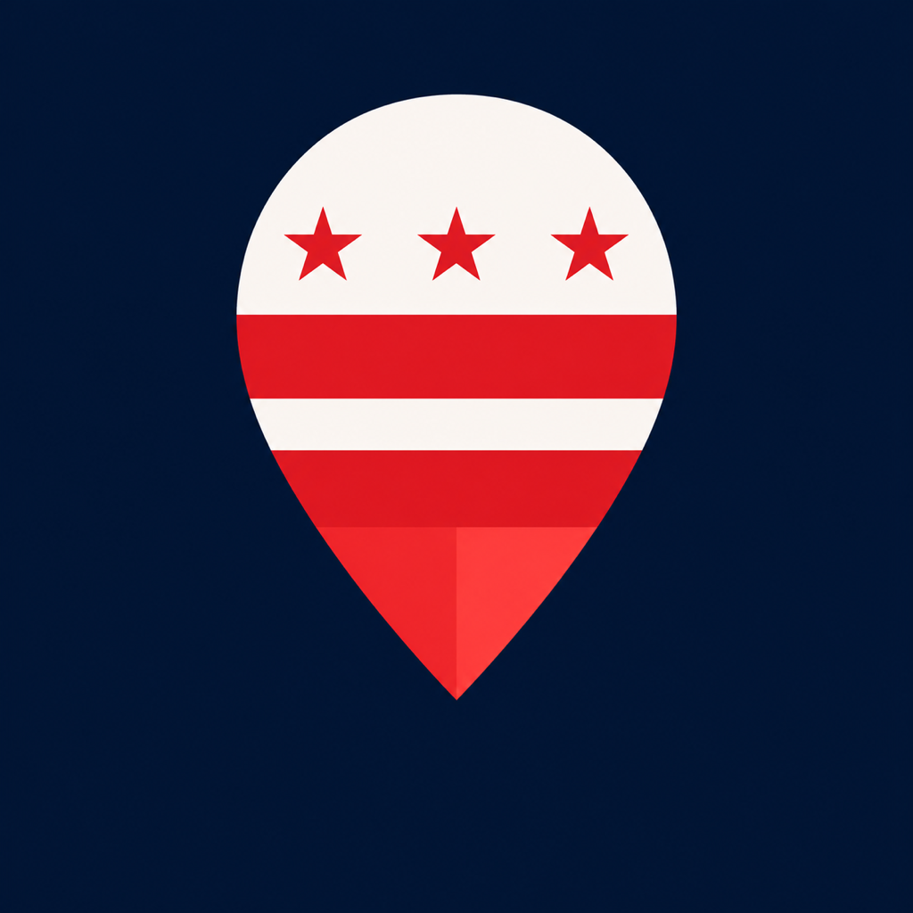
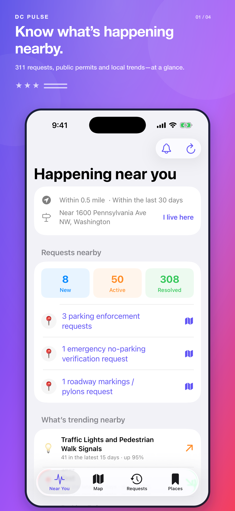
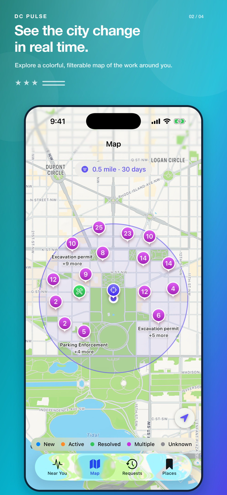
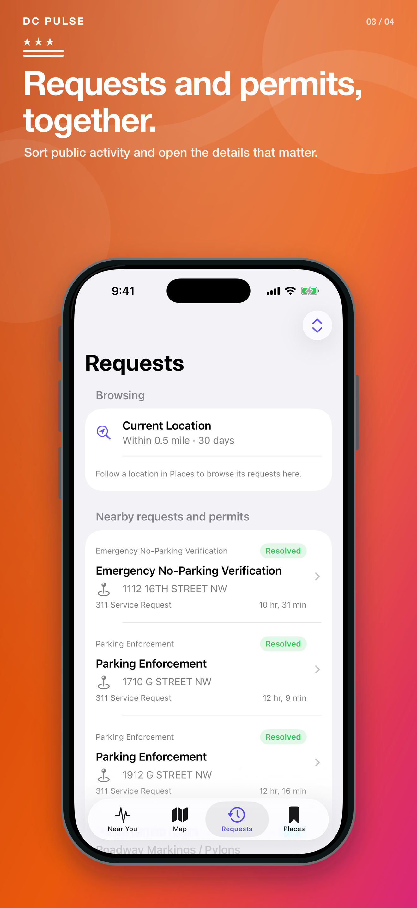
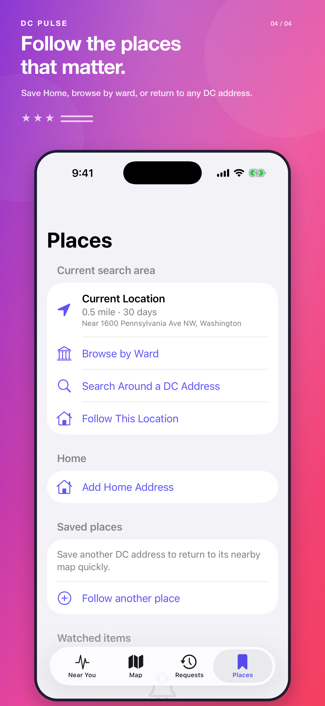

<div align="center">
  
  <h1>DC Pulse</h1>
  <p><strong>See what’s changing around you in Washington, DC.</strong></p>
  <p>
    <a href="https://dcpulseapp.com">Website</a> ·
    <a href="https://dcpulseapp.com/#privacy">Privacy</a> ·
    <a href="https://dcpulseapp.com/#support">Support</a> ·
    <a href="docs/product-plan.md">Product plan</a> ·
    <a href="LICENSE">MIT License</a>
  </p>
</div>

DC Pulse is a native, map-forward iPhone app for exploring recent public activity around a location in Washington, DC. It turns DC’s ArcGIS and Open Data services into one approachable view of 311 service requests, building permits, and DDOT construction permits—without exposing people to raw GIS complexity.

> **Project status:** Pre-release. Version 1.0 (build 6) is available to external TestFlight testers. Build 7 has been uploaded and is available to internal TestFlight testers, but has not yet been assigned to external testers. DC Pulse has not been submitted for public App Store review.

<p align="center">
  
  
  
  
</p>

## What DC Pulse does

- **Near You** summarizes nearby requests, noteworthy changes, leading categories, and local trends.
- **Map** combines three public datasets with native clustering, lifecycle colors, search-area context, and expandable filters.
- **Requests** provides a chronological, sortable list for the current search or a followed place.
- **Places** saves Home and other meaningful DC locations on-device for quick return visits.
- **Item Details** normalizes dates, status, agency, address, source attributes, and official civic-action destinations.
- **Watches** track selected public records on-device, can auto-watch new activity close to Home, and move resolved records into a visible, restorable archive after a configurable grace period.
- **Notifications** keep an on-device history with category-aware symbols and direct navigation back to the affected public record. Optional, privacy-safe system alerts can be chosen separately for watched status changes and new items near Home.
- **Report to 311 (beta)** turns a deliberately selected or captured photo into an editable, on-device request draft before an official DC app or website handoff.
- **Item actions** make public details easy to copy, prepare permit-violation context, and provide an honest copy-and-search handoff for 311 request IDs.
- **About DC Pulse** keeps the website, support, privacy policy, source code, MIT terms, public-data attribution, and installed build information available inside the app.
- **Restaurant Health (data-gated)** models DC's real pass/fail and violation terminology. Nearby inspection reports and a useful inspection map will ship only after a dependable source contract or a separately reviewed ingestion approach is established.

Location is requested only to perform a nearby search. If access is unavailable, DC Pulse loads a clearly labeled Downtown DC view instead of leaving the app empty; people can open Settings, browse by ward, or search around a DC address. A device just outside the supported DC area is routed to a nearby search center inside DC without being represented or saved as the person's current location. The default search covers **half a mile** and the **last 30 days**, with additional radius and time options available on Map.

## Current TestFlight focus

Build 6 packages the reliability and trust work completed after build 5:

1. Independent close-in and selected-radius Map coverage, progressive loading feedback, stale-response rejection, and an atomic **Reset Filters** action.
2. Complete grouped 311 status and category summaries with explicit unavailable states instead of misleading first-page totals.
3. Native Requests pull-to-refresh, distinct Photos and Camera inputs, and silent age-derived New-to-Active watch transitions.
4. Useful denied/unavailable/out-of-area location routing without mislabeling an adjusted search center as the person's current location.
5. Category-aware notification rows, address-free lock-screen alert copy, copyable Item Details, an honest 311 ID lookup handoff, and an in-app About surface.
6. Independent system-alert choices for watched status changes and new auto-watched items near Home, with existing preferences migrated forward.
7. Explainable trend provenance, reversible watched-item archival, configurable resolved-watch retention, and deterministic archive/restore and followed-place navigation coverage.

Build 7 additionally isolates auxiliary pagination warnings from primary source availability, makes the nearby category summary status-scoped and expandable, separates lifecycle transition history from the current observation index, and applies a documented one-year on-device retention and migration policy.

The next release gate is to complete build 7's internal TestFlight verification, assign it to the intended external group, and run a focused physical-iPhone and external TestFlight soak covering location, filters, dense map coverage, watched-item navigation, local alerts, photo input, accessibility, migration from an installed prior build, and official external handoffs. Durable restaurant-inspection ingestion and supported direct 311 submission remain contract-gated follow-on work.

Richer long-term trends, widgets, and optional civic overlays remain planned, but they follow the submission-path and release-quality work above. See the [ranked roadmap](docs/roadmap.md) for acceptance criteria and dependency gates.

## Data sources

Each source has its own adapter and repository; source-specific ArcGIS records never reach SwiftUI views.

| Source | Current integration |
| --- | --- |
| DC 311 City Service Requests | Live 2026 layer, category counts, trends, and targeted filtering |
| DC Building Permits | Live 2026 layer with permit-specific normalization |
| DDOT Construction Permits | Live 2026 layer with public-space work details |

The verified endpoints, schema notes, query contract, and known source limitations are documented in [Data sources](docs/data-sources.md). Public records can be delayed, incomplete, or changed by their publishers; DC Pulse is not an official DC government service.

## Privacy by design

DC Pulse has no account system, advertising SDK, analytics SDK, or custom backend. Home, followed places, watched items, cached results, and preferences stay in on-device storage. Nearby searches send the selected coordinate and query parameters directly to the relevant DC ArcGIS service, without a DC Pulse account or device identifier. Photo classification for a 311 draft runs on-device; DC Pulse does not read photo location metadata, upload the photo, or submit the request.

See [App Store readiness](docs/app-store-readiness.md) for the current privacy inventory and disclosure assumptions.

## Architecture

DC Pulse uses feature-oriented MVVM with protocol-backed networking and location dependencies.

```text
SwiftUI feature view → feature view model → repository protocol
                                            ↓
                              source-specific ArcGIS adapter
                                            ↓
                                  ArcGIS client / URLSession
```

```text
DCPulse/DCPulse/
├── App/                 App composition and shared state
├── Core/
│   ├── Location/        Core Location boundary
│   ├── Models/          Unified domain and persistence models
│   ├── Networking/      ArcGIS query, client, and pagination
│   └── Notifications/   Watch reconciliation and local alerts
├── DesignSystem/        Reusable native components
├── Features/            Near You, Map, Requests, Places, Item Details, Health, Report 311
└── Resources/Fixtures/  Redacted representative payloads
```

The complete design and data-flow decisions live in [Architecture](docs/architecture.md).

## Development

The project is intentionally dependency-light and uses Swift, SwiftUI, MapKit, Core Location, SwiftData, URLSession, and XCTest. The current project is verified with Xcode 26.6 and targets iPhone on iOS 26.5 or later.

Open [DCPulse.xcodeproj](DCPulse/DCPulse.xcodeproj) and use the shared `DCPulse` scheme, or build from the command line:

```sh
xcrun simctl list devices available

xcodebuild \
  -project DCPulse/DCPulse.xcodeproj \
  -scheme DCPulse \
  -destination 'platform=iOS Simulator,name=<available iPhone>' \
  build

xcodebuild \
  -project DCPulse/DCPulse.xcodeproj \
  -scheme DCPulse \
  -destination 'platform=iOS Simulator,name=<available iPhone>' \
  test
```

Never change the development team, signing configuration, entitlements, provisioning, or bundle identifiers without explicit project-owner approval.

## Documentation

- [Product plan](docs/product-plan.md) — vision, screen plan, defaults, and delivery sequence
- [Architecture](docs/architecture.md) — boundaries, state, networking, watches, trends, and map rendering
- [Data sources](docs/data-sources.md) — authoritative layers, mappings, and resilience rules
- [Ranked roadmap](docs/roadmap.md) — release priorities and future work
- [Map performance and Near You discovery](docs/map-performance-home-discovery.md) — measurement plan, cache investigation, home-screen concepts, and radius decision gate
- [App Store readiness](docs/app-store-readiness.md) — privacy, metadata, and device quality gates
- [App Store listing](docs/app-store-listing.md) — copy-ready metadata, privacy answers, review notes, and screenshot sequence
- [TestFlight checklist](docs/testflight-release.md) — internal beta preparation and smoke test

## Contributing and security

DC Pulse is open source under the [MIT License](LICENSE). Read [CONTRIBUTING.md](CONTRIBUTING.md) and the [Code of Conduct](CODE_OF_CONDUCT.md) before proposing a change. Please report security or privacy concerns privately according to [SECURITY.md](SECURITY.md), especially if they involve a precise location, saved address, credential, or unpublished vulnerability.

## Acknowledgments

DC Pulse is made possible by public data published by the Government of the District of Columbia. It is an independent project and is not endorsed by, affiliated with, or a substitute for DC 311 or any District agency. For emergencies, call 911; use official DC services to submit or confirm government requests.
